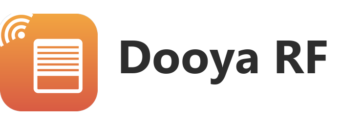

# Dooya RF Covers — Home Assistant Integration

<picture>
  <source media="(prefers-color-scheme: dark)" srcset="custom_components/dooya/brand/dark_logo.png">
  
</picture>

Control Dooya RF433 motorized covers (blinds/shutters/rollers) from Home Assistant.

## Features

- **Open / Close / Stop** via a native ESPHome service
- **Estimated position** based on real opening and closing travel times
- **Set position** support for partial opening/closing directly from Home Assistant
- **Manual recalibration services** to mark a cover as open, closed, or set a known position
- **Recalibration & calibration buttons** on the device page — no service call needed
- **Travel-time calibration assistant** — measures the real opening/closing times with a stopwatch instead of manual entry
- **Favorite position** — per-shutter option + one-press button, like real Dooya remotes
- **Broadcast channel 0** — one entity that opens/closes every shutter paired with the remote in a single RF frame
- **Gateway-linked availability** — entities become `unavailable` when the ESPHome node is offline
- **Diagnostics download** for easier GitHub issues
- **Bundled Lovelace card** (`custom:dooya-cover-card`) — animated shutter with position, presets and recalibration, normal & compact views, no HACS frontend install needed
- **Automatic detection from the remote** — press UP on the physical remote to read the shutter ID automatically
- **Manual entry** — enter the shutter ID directly if you already know it
- **User-friendly setup flow** — choose between manual entry and automatic detection
- **No extra ESPHome buttons required** — one cover entity per shutter in Home Assistant
- **OEM brands supported** : Dooya, Cherub, Raex, Zemismart, and all clones using the same protocol

## Requirements

- Home Assistant 2026.5+
- An ESPHome device exposing the `transmit_dooya` service
- A 433.92 MHz OOK transmitter, typically ESP32 + CC1101

## Installation (HACS)

1. In HACS, open the menu for custom repositories
2. Add `https://github.com/dasimon135/ha-dooya` as an `Integration` repository
3. Install "Dooya RF Covers"
4. Restart Home Assistant
5. **Settings → Integrations → Add → Dooya RF Covers**

Manual installation is also possible by copying `custom_components/dooya` into your Home Assistant configuration directory.

## Support

When opening an issue, please attach the **diagnostics download** (device page → three-dot menu → *Download diagnostics*): it contains the entry configuration (remote id redacted) and the current cover state.

- Bug reports and feature requests: https://github.com/dasimon135/ha-dooya/issues
- Repository: https://github.com/dasimon135/ha-dooya
- Step-by-step French tutorial: docs/tuto-hacf.md
- HACF forum post template: docs/post-hacf.md

## Installation (manual)

1. Copy `custom_components/dooya` into your Home Assistant configuration directory
2. Restart Home Assistant
3. **Settings → Integrations → Add → Dooya RF Covers**

## ESPHome Prerequisite (CC1101)

This integration now relies on a native ESPHome service.

Your ESPHome node must:

- expose an action/service named `transmit_dooya`
- be integrated in Home Assistant through the ESPHome integration
- have **Allow service calls** enabled in the ESPHome integration options
- optionally expose a `remote_receiver` with `dump: dooya` if you want automatic detection from the remote

Example ESPHome pieces required for automatic detection and transmission:

```yaml
esphome:
  on_boot:
    priority: -100
    then:
      - cc1101.begin_rx: mycc1101

api:
  services:
    - service: transmit_dooya
      variables:
        dooya_id: int
        channel: int
        btn: int
        check: int
      then:
        - lambda: |-
            esphome::remote_base::DooyaData d{};
            d.id      = (uint32_t)dooya_id;
            d.channel = (uint8_t)channel;
            d.button  = (uint8_t)btn;
            d.check   = (uint8_t)check;
            auto call = id(rf_transmitter).transmit();
            esphome::remote_base::DooyaProtocol().encode(call.get_data(), d);
            call.set_send_times(5);
            call.set_send_wait(1000);
            call.perform();

cc1101:
  id: mycc1101
  cs_pin: GPIO5
  frequency: 433.92MHz
  output_power: 10
  modulation_type: ASK/OOK
  symbol_rate: 5000
  filter_bandwidth: 203kHz

remote_transmitter:
  - id: rf_transmitter
    pin:
      number: GPIO4
    carrier_duty_percent: 100%
    non_blocking: false
    on_transmit:
      then:
        - cc1101.begin_tx: mycc1101
    on_complete:
      then:
        - cc1101.begin_rx: mycc1101

remote_receiver:
  pin: GPIO16
  dump: dooya
  on_dooya:
    then:
      - if:
          condition:
            api.connected:
              state_subscription_only: true
          then:
            - homeassistant.event:
                event: esphome.dooya_received
                data_template:
                  id: "{{ dooya_id }}"
                  channel: "{{ dooya_channel }}"
                  button: "{{ dooya_button }}"
                  check: "{{ dooya_check }}"
                variables:
                  dooya_id: !lambda |-
                    char buf[9];
                    snprintf(buf, sizeof(buf), "%08" PRIX32, x.id);
                    return std::string(buf);
                  dooya_channel: !lambda |-
                    return std::to_string(x.channel);
                  dooya_button: !lambda |-
                    return std::to_string(x.button);
                  dooya_check: !lambda |-
                    return std::to_string(x.check);
          else:
            - logger.log:
                format: "Trame Dooya reçue mais Home Assistant n'est pas connecté via l'API, événement non envoyé"
                level: WARN
```

Note: if you use `homeassistant.event`, Home Assistant must allow the ESPHome device to perform Home Assistant actions.

## Home Assistant Setup

1. Add the Dooya RF Covers integration
2. Select the ESPHome device that will send the commands
3. Choose one of the two setup methods:
   Manual entry if you already know the shutter identifier.
   Automatic detection from the remote if you want Home Assistant to read it for you.
4. Enter the full opening and closing travel times for that cover
5. Create one config entry per shutter

### What automatic detection does

Automatic detection does **not** pair the shutter and does **not** change its configuration.

It only listens to the signal sent by the physical remote control, then reads:

- the shutter identifier
- the channel

Once these values are known, Home Assistant can generate **Open**, **Stop**, and **Close** commands for the same shutter.

## Bundled Lovelace Card

The integration ships its own dashboard card — it is registered automatically, nothing to install or declare in Lovelace resources.

Add it from the dashboard card picker ("Dooya Cover Card", with a visual editor), or via YAML:

```yaml
type: custom:dooya-cover-card
entity: cover.living_room_shutter
```

The card shows:

- an **animated window** that tracks the estimated position in real time — click anywhere in the window to send the shutter to that height
- **Open / Stop / Close** buttons
- a **position slider** and **preset chips** (0 / 25 / 50 / 75 / 100 %)
- **recalibration shortcuts** calling `dooya.mark_open` / `dooya.mark_closed` (shown only for Dooya entities)

Options:

| Option | Default | Description |
|--------|---------|-------------|
| `entity` | — | Cover entity (required) |
| `name` | entity name | Card title |
| `view` | `normal` | `normal` (full animated window) or `compact` (one-line bar with up/stop/down) |
| `show_presets` | `true` | Show the preset position chips |
| `show_calibration` | `true` | Show the recalibration shortcuts |

The window scenery follows the sun (`sun.sun`): sunrise and sunset tints, bright day, and a starry night with the moon. 🌙

The compact view fits dashboards with many shutters: a clickable position bar (left = closed, right = open), the up/stop/down buttons and the favorite button when one is configured. A star chip also appears in the normal view when a favorite position is set in the integration options.

Labels follow the Home Assistant UI language (English / French).

## Cleaning Up Old ESPHome Buttons

If you previously exposed one ESPHome button per action and per shutter, they are no longer needed.

Recommended cleanup:

1. Remove the old `button:` section from your ESPHome YAML
2. Reflash or OTA-update the ESPHome node
3. Reload the ESPHome integration in Home Assistant

After that, keep only the Dooya cover entities.

## Estimated Position And Calibration

This integration can estimate the current cover position without a physical position sensor.

It works by combining:

- the configured full opening time
- the configured full closing time
- the commands sent from Home Assistant
- the RF frames received from the physical remote

Important: this remains an estimated position, not a true measured position.

If needed, you can recalibrate a cover manually with the entity services exposed by the integration:

- `dooya.mark_open`
- `dooya.mark_closed`
- `dooya.set_known_position`

The same actions are also available as **button entities** on the shutter's device page (*Set as open*, *Set as closed*), usable directly from the UI and in automations.

### Calibration assistant

Instead of measuring travel times with a stopwatch, use the two calibration buttons on the device page:

1. fully close the shutter, then press **Calibrate opening time** — the shutter starts opening
2. press **STOP** (in Home Assistant or on the physical remote) at the exact moment it is fully open
3. the measured time is saved to the integration options automatically (a notification confirms the value)
4. repeat from the open position with **Calibrate closing time**

Persistent notifications guide each step; the measurement is cancelled automatically after 240 s without a STOP.

### Favorite position

Set a **favorite position** (for example 30 %) in the integration options. A *Favorite position* button then appears on the device page (and a star chip on the bundled card) that sends the shutter there in one press — like the favorite button of real Dooya remotes.

## Broadcast Channel (All Shutters)

Dooya multi-channel remotes have an "all" button that transmits on **channel 0**: every shutter paired with the remote executes the command from a single RF frame.

You can create such an entity with manual entry by setting the channel to `0`. It exposes open/close/stop only (no position estimate, since each shutter moves independently), and is ideal for "close everything" automations — one RF frame instead of one per shutter.

Broadcast frames are also understood the other way around: when the remote's "all" button is pressed (or the HA broadcast entity is used), the position estimate of every per-channel cover with the same remote id is updated accordingly.

## Position Confidence

The cover exposes two attributes reflecting how much the estimate may have drifted:

- `moves_since_sync` — number of moves that ended between the end stops since the last full open/close
- `position_confidence` — `high` (0–4), `medium` (5–9) or `low` (10+)

Every full travel to an end stop (or a manual recalibration) resets the counter. If confidence turns `low`, simply open or close the shutter fully once.

## Automation Blueprint

The repo ships a ready-to-import blueprint ([blueprints/automation/dooya/shutters_sun.yaml](blueprints/automation/dooya/shutters_sun.yaml)) that:

- closes the shutters when the sun drops below a configurable elevation
- opens them in the morning above a configurable elevation (never before a chosen time)
- optionally closes them during hot days (outdoor temperature sensor + threshold) and reopens once it cools down

[](https://my.home-assistant.io/redirect/blueprint_import/?blueprint_url=https%3A%2F%2Fgithub.com%2Fdasimon135%2Fha-dooya%2Fblob%2Fmain%2Fblueprints%2Fautomation%2Fdooya%2Fshutters_sun.yaml)

## RF Reliability (Repeat Count)

RF433 OOK is a one-way protocol with no acknowledgement. In environments with RF interference (other 433 MHz devices, Wi-Fi, etc.), a command may occasionally be lost.

The **RF transmission repeat count** option (accessible via **Settings → Integrations → Dooya → Configure**) controls how many times each command is sent:

| Value | Behaviour |
|-------|-----------|
| 1 | Single transmission — default, suitable for most environments |
| 2 | Two transmissions, 100 ms apart — recommended if commands are occasionally missed |
| 3 | Three transmissions — for very noisy RF environments |

> ⚠️ Do not exceed 3 repetitions. Some Dooya motors may interpret repeated signals as a pairing or limit-setting command.

## Protocol

Dooya RF433 OOK — timings (µs):

| Symbol | HIGH | LOW  |
|--------|------|------|
| Header | 5000 | 1500 |
| Bit 1  | 750  | 350  |
| Bit 0  | 350  | 750  |

Frame: `header + 24-bit ID + 8-bit channel + 4-bit button + 4-bit check`

Buttons: `UP=1`, `DOWN=3`, `STOP=5`

## Release Status

Current version: `0.4.0`

Current architecture:

- Home Assistant custom integration with config flow
- ESPHome RF433 sender/receiver using a native `transmit_dooya` action/service
- Automatic learning based on the `esphome.dooya_received` event sent by the ESPHome node
- Estimated position based on configured travel times, with manual recalibration services

## License

MIT
